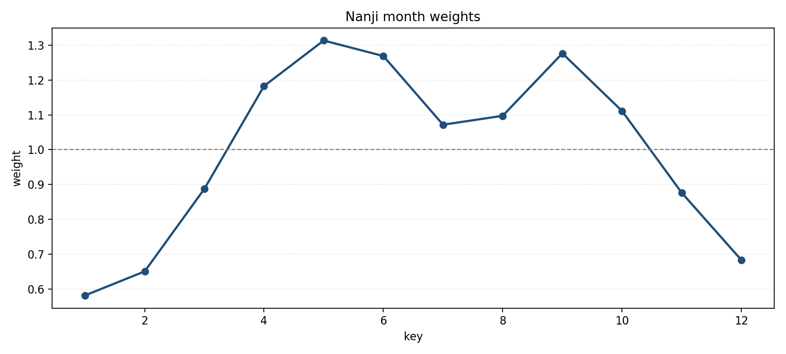
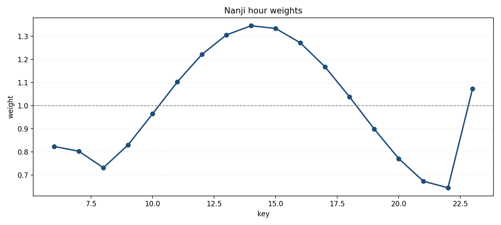
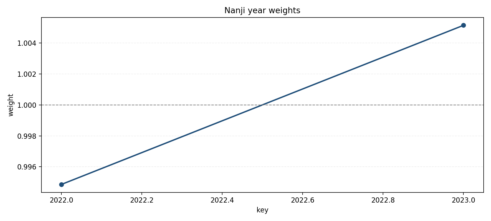
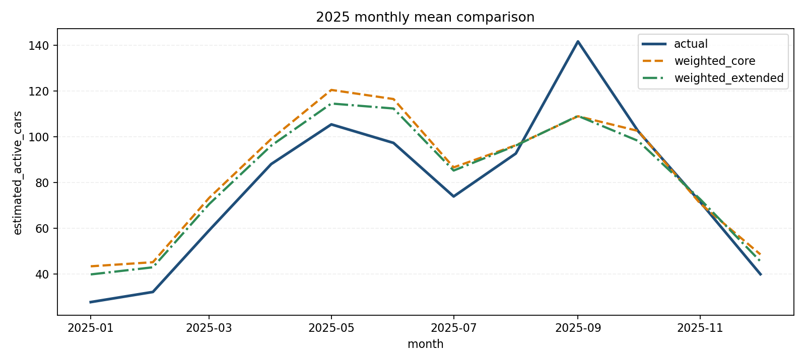

# 난지 한강공원 시간별 데이터 분석 및 머신러닝 보고서

## 1. 보고서 목적

이 문서는 `hmw/Note` 폴더에 정리된 난지 한강공원 관련 분석 자료와 머신러닝 결과를 `ksm` 경로에서 바로 활용할 수 있도록 하나의 보고서로 재구성한 것이다.  
핵심 목적은 다음과 같다.

- 난지 시간별 데이터셋이 어떤 방식으로 만들어졌는지 정리
- 데이터 해석 시 주의점과 품질 상태를 요약
- 가중치 기반 Ridge 회귀 모델의 구조와 성능을 정리
- 시각화 결과를 함께 배치해 추세를 빠르게 확인할 수 있도록 구성

## 2. 참고한 원본 자료

- `hmw/Note/nanji_weighted_ridge_modeling_report.md`
- `hmw/Note/nanji_weighted_ridge_analysis.py`
- `hmw/Note/nanji_outputs/*.csv`
- `hmw/Note/nanji_outputs/*.png`
- `ksm/nanji_hourly_modeling/nanji_selected_data_analysis.md`
- `ksm/nanji_hourly_modeling/nanji_hourly_dataset_methodology.md`
- `ksm/nanji_hourly_modeling/nanji_hourly_feature_dictionary.md`

## 3. 데이터셋 개요

이번 모델링의 기본 데이터는 `ksm/nanji_hourly_modeling/nanji_hourly_model_dataset_2020_2026.csv`이다.  
다만 실제 머신러닝 학습 및 평가는 `2022~2025` 구간을 사용했다.

### 핵심 요약

- 데이터 단위: 1시간
- 모델링 타깃: `estimated_active_cars`
- 학습 구간: 2022~2023
- 검증 구간: 2024
- 테스트 구간: 2025
- 분석 대상 시간: 운영시간 `06:00~23:00` 중심

### 중요한 해석 포인트

- `estimated_active_cars`는 실측 시간별 주차 로그가 아니라, 일별 주차 원본을 시간축으로 확장해 만든 추정값이다.
- 따라서 이 모델은 "실측 점유대수 예측"이라기보다 "추정 점유량 예측"으로 해석하는 것이 안전하다.
- `00:00~05:00` 구간은 운영시간 외로 간주되어, 현재 구조에서는 타깃과 예측값을 모두 `0`으로 처리한다.

## 4. 시간별 데이터가 만들어진 방식

난지 주차장에 대한 직접적인 시간별 실측 로그가 워크스페이스에서 확인되지 않았기 때문에, 일별 원본과 외생 데이터를 결합한 시간별 통합 데이터셋을 사용했다.

### 생성 흐름

1. `hmw/Data/한강공원 주차장 일별 이용 현황.csv`에서 난지 주차장 데이터를 선택
2. 날짜별 `주차대수`, `이용시간`을 집계
3. 평일/비평일 및 계절별 시간 프로필을 이용해 `estimated_entries` 생성
4. 평균 체류시간을 반영해 `estimated_active_cars` 생성
5. 공휴일 정보 병합
6. 버스/지하철 월별 시간대 패턴 병합
7. 자전거 대여 이력의 일별-시간대 집계 병합
8. 문화행사 일별 집계 병합
9. 주변 공영주차장, 킥보드 구역 등 정적 참고 정보 추가

## 5. 사용한 주요 feature

### 기본 캘린더/패턴 변수

- `year`, `month`, `day`, `hour`, `day_of_week`
- `is_weekend`, `is_holiday`, `is_long_weekend`
- `day_type`

### 타깃 및 파생 변수

- `estimated_entries`
- `estimated_active_cars`
- `estimated_active_cars_change`

### 외생 변수

- 버스: `bus_boardings`, `bus_alightings`
- 지하철: `subway_boardings`, `subway_alightings`
- 자전거: `bike_rentals`, `bike_returns`, `bike_rental_minutes_sum`, `bike_rental_distance_m_sum`
- 행사: `event_count`, `free_event_count`, `paid_event_count`, `evening_event_count`
- 날씨: `temperature_2m`, `precipitation`, `cloud_cover`, `wind_speed_10m` 등

### feature 가용률

| feature | coverage_rate |
| --- | ---: |
| weather_feature_available | 1.000 |
| subway_feature_available | 0.924 |
| bus_feature_available | 0.720 |
| bike_feature_available | 0.332 |
| culture_feature_available | 0.188 |

해석상 날씨와 지하철은 비교적 안정적으로 쓰일 수 있지만, 버스·자전거·문화행사 변수는 기간 제약이 있어 보조 설명 변수로 보는 편이 적절하다.

## 6. 데이터 품질 점검

머신러닝 보고서 기준 `2022~2025` 범위에서 데이터 품질은 아래와 같다.

| 항목 | 값 |
| --- | ---: |
| rows | 34,920 |
| unique_datetime | 34,920 |
| duplicate_rows | 0 |
| target_missing | 0 |
| target_min | 0 |
| target_max | 1219.57 |

### 해석 메모

- `holiday_name` 결측은 비휴일 날짜가 많기 때문에 자연스러운 결측이다.
- `bus_*` 계열은 일부 기간만 채워져 있어 전 기간 설명력은 제한적이다.
- 운영시간 외 `0~5시`는 행은 존재하지만 타깃이 전부 0인 구조다.

## 7. 모델링 구조

이번 작업은 이전 통합 분석 흐름을 난지 단일 사이트용으로 단순화한 가중치 기반 Ridge 회귀다.

### 절차

1. `train(2022~2023)`에서 `day_type x hour` 평균 패턴을 적합해 `base_value` 생성
2. 실제값 대비 비율로 `month_weight` 계산
3. `pattern_prior = base_value * month_weight` 구성
4. 운영시간 `06~23시`만 사용해 `hour_weight` 계산
5. `corrected_pattern_prior = pattern_prior * hour_weight` 생성
6. 이 패턴 변수와 외생 변수를 입력으로 Ridge 회귀 학습

### 비교한 모델

- `weighted_core`
  - 패턴 기반 핵심 변수 위주
  - 미래 예측 시점에도 상대적으로 사용 가능
- `weighted_extended`
  - 패턴 변수 + 교통 + 자전거 + 행사 + 날씨 등 확장 변수 포함
  - 오프라인 성능은 더 좋지만, 실제 미래 예측 운영에는 제약이 큼

## 8. 기본 패턴식과 가중치 해석

### day type별 기본 패턴식

| day_type | intercept | sin_hour_coef | cos_hour_coef |
| --- | ---: | ---: | ---: |
| weekday | 61.4373 | -46.3292 | -70.4183 |
| offday | 128.2034 | -138.7083 | -91.8155 |

비평일(`offday`)의 절편이 더 높고 시간 계수의 진폭도 커서, 주말/공휴일 수요 변동성이 평일보다 크다는 점을 보여준다.

### 월 가중치 해석

- 봄~초가을이 높고, 겨울이 낮다.
- 특히 `5월(1.3132)`, `6월(1.2688)`, `9월(1.2764)`가 강한 월 효과를 보인다.
- `1월(0.5817)`, `2월(0.6506)`, `12월(0.6832)`은 낮은 수요 구간이다.



### 시간 가중치 해석

- 오전보다 점심 이후 수요가 높게 형성된다.
- `14시(1.3457)`, `15시(1.3340)`, `13시(1.3063)`, `16시(1.2720)` 순으로 강한 효과가 나타난다.
- 운영시간 초반인 `6~8시`는 상대적으로 낮은 가중치를 가진다.



### 연도 가중치 그림

최종 실사용 설명에서는 `year_weight`를 제외했지만, 산출물에는 연도별 가중치 시각화도 남아 있다.



## 9. 모델 성능 비교

### 전체 성능

| model_name | split | alpha | rmse | mae | r2 |
| --- | --- | ---: | ---: | ---: | ---: |
| weighted_core | train | 1000.0 | 53.0312 | 27.5288 | 0.7839 |
| weighted_core | valid | 1000.0 | 54.6437 | 28.9268 | 0.7437 |
| weighted_core | test | 1000.0 | 59.5412 | 30.0448 | 0.7260 |
| weighted_extended | train | 1000.0 | 50.3350 | 26.1202 | 0.8053 |
| weighted_extended | valid | 1000.0 | 50.6555 | 28.6089 | 0.7797 |
| weighted_extended | test | 1000.0 | 56.5413 | 28.0469 | 0.7529 |

### 해석

- 오프라인 테스트 기준 최고 성능 모델은 `weighted_extended`다.
- 추천 alpha도 두 모델 모두 `1000.0`에서 선택되었다.
- 다만 실제 운영에서는 미래 시점의 행사, 날씨, 일부 교통 변수를 안정적으로 알기 어렵기 때문에, 실사용 예측 모델은 `weighted_core`를 채택하는 해석이 더 적절하다.

## 10. 중요 변수와 pruning 결과

### `weighted_core` 중요 변수

| feature | importance_ratio |
| --- | ---: |
| hour_weight | 0.6460 |
| month_weight | 0.3339 |
| day_type_offday | 0.0102 |
| pattern_prior | 0.0098 |

핵심 모델은 사실상 `month_weight`와 `hour_weight`가 대부분의 설명력을 담당한다.

### `weighted_extended` 중요 변수 상위

| feature | coefficient | importance_ratio |
| --- | ---: | ---: |
| hour_weight | 59.4609 | 0.2313 |
| month_weight | 36.9751 | 0.1438 |
| is_holiday | -18.8699 | 0.0734 |
| month_cos | 12.9056 | 0.0502 |
| hour_cos | 7.8804 | 0.0307 |
| hour_sin | 6.3340 | 0.0246 |
| subway_feature_available | -3.4656 | 0.0135 |
| month_sin | 3.1923 | 0.0124 |

머신러닝 결과에서도 외생 변수보다 패턴 기반 변수의 영향력이 훨씬 크다.

### 상관관계 pruning

절대 상관계수 `0.9` 이상인 변수쌍은 타깃과의 상관이 더 큰 변수를 남기는 방식으로 정리했다. 대표 사례는 다음과 같다.

- `pattern_prior` 유지, `base_value` 제거
- `pattern_prior` 유지, `corrected_pattern_prior` 제거
- `bus_alightings` 유지, `bus_boardings` 제거
- `bike_rental_minutes_sum` 유지, `bike_rentals` 제거
- `temperature_2m` 유지, `apparent_temperature` 제거
- `precipitation` 유지, `rain` 제거

이는 다중공선성을 줄이기 위한 전처리 단계로 이해하면 된다.

## 11. 2025년 오차 특성

2025년 테스트셋 기준 오차가 큰 구간은 한낮~오후 시간대에 집중됐다.

### 시간대별 특징

- 큰 오차가 발생한 대표 시간: `12시~18시`
- 특히 `14~17시` 구간에서 절대오차가 가장 큼
- 이는 실제 수요 피크 시간대에서 패턴 기반 추정의 한계가 더 크게 드러났다는 의미다.

### 월별 특징

- 오차가 큰 대표 월: `9월`, `4월`, `6월`, `10월`, `5월`
- 봄/가을 성수기 월에서 수요 변동성이 커 모델 난도가 높았던 것으로 해석할 수 있다.

### 월별 실제값-예측값 비교 시각화



## 12. 실무 적용 시 해석

현재 모델이 직접 예측하는 것은 `estimated_active_cars`이므로, 최종 관심 지표인 여유 주차공간 수는 아래 방식으로 계산해야 한다.

```text
predicted_occupied_cars = predicted_estimated_active_cars
available_spaces = max(total_capacity - predicted_occupied_cars, 0)
occupancy_rate = predicted_occupied_cars / total_capacity
```

### 주의사항

- 현재 통합 CSV에는 난지 주차장 자체의 확정 총 주차면 수가 직접 포함되어 있지 않다.
- `nearby_public_parking_capacity_sum`은 주변 공영주차장 합계이므로 난지 메인 주차장의 총 면수로 쓰면 안 된다.
- 따라서 여유 주차공간의 절대값 계산을 위해서는 별도의 공식 총 주차면 수 기준이 필요하다.

## 13. 최종 결론

이번 난지 한강공원 시간별 주차 예측 분석은, 실측 시간 로그가 부재한 상황에서 일별 주차 원본과 교통·행사·날씨 등 외생 데이터를 결합해 시간별 추정 점유량을 모델링한 작업이다.

핵심 해석은 다음과 같다.

- 난지 수요는 계절성과 시간대 패턴의 영향이 매우 크다.
- 월 가중치와 시간 가중치만으로도 상당한 설명력이 확보된다.
- 오프라인 성능은 `weighted_extended`가 더 좋지만, 실제 미래 예측 운영에는 `weighted_core`가 더 현실적이다.
- 결과는 "실측 점유량"이 아니라 "추정 점유량" 기반 모델이므로, 실무 적용 시 이 한계를 반드시 함께 설명해야 한다.

## 14. 함께 정리한 시각화 파일

- `ksm/nanji_hourly_modeling/nanji_analysis_ml_assets/nanji_month_weights.png`
- `ksm/nanji_hourly_modeling/nanji_analysis_ml_assets/nanji_hour_weights.png`
- `ksm/nanji_hourly_modeling/nanji_analysis_ml_assets/nanji_year_weights.png`
- `ksm/nanji_hourly_modeling/nanji_analysis_ml_assets/nanji_2025_monthly_compare.png`
